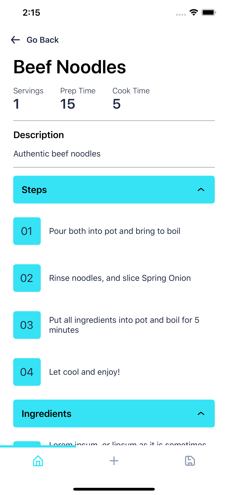

# Recipies App

This project aims to make access to quick and simple (and tasty) recipies easier for all. 

## TODO

* Currently developing an API with a database from which the app will pull recipies from. Eventually, this will be integrated into an explore page.

## Application Views

<table>
    <tr></tr>
    <tr>
        <td align='center'></td>
        <td align='center'></td>
    </tr>
    <tr></tr>
    <tr>
        <td align='center'></td>
        <td align='center'></td>
    </tr>
</table>

## Colour Scheme Creation

<kbd></kbd>

## Technologies & Packages

* JavaScript
* Python
* React-Native
* Sqlite
* UI Kitten (A React-Native ui kit)
* React-native-sqlite-storage 
* Flask/Flast-Restful
* Eva design system